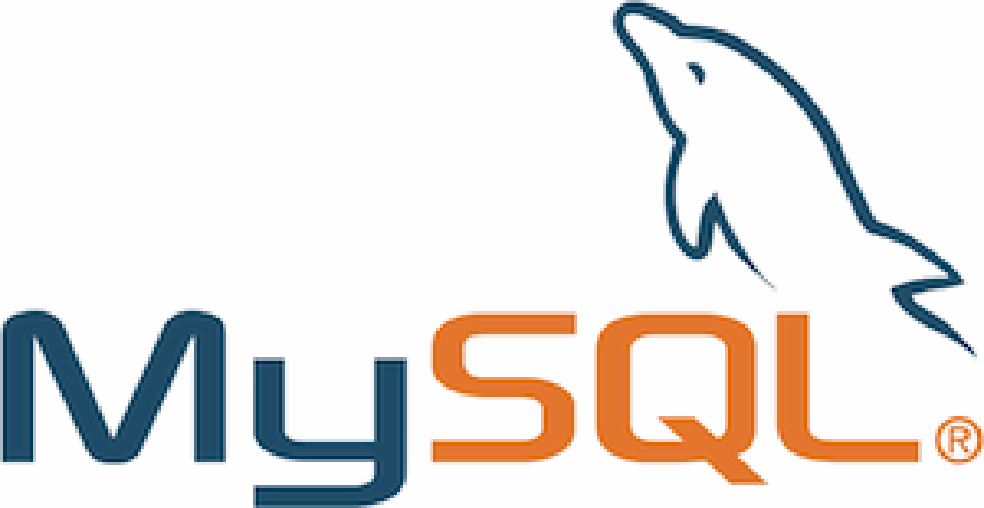

# SQL (Structured Query Language):

* SQL é uma linguagem de programação utilizada para gerenciar bancos de dados relacionais. Com SQL, é possível realizar diversas operações, como criar e modificar estruturas de tabelas, inserir, atualizar e excluir dados, e consultar informações específicas de um banco de dados.

# CSS (Cascading Style Sheets):

* CSS é uma linguagem de estilo utilizada para definir a apresentação visual de documentos HTML e XML. Ela controla como os elementos HTML são exibidos na tela, incluindo layout, cores, fontes, espaçamentos e efeitos visuais.

# HTML (HyperText Markup Language):

* HTML é a linguagem padrão para criar páginas web e aplicativos web. Ele define a estrutura de uma página usando uma série de elementos ou tags que descrevem o conteúdo, como textos, imagens, links, formulários, entre outros.

# JavaScript:

* JavaScript é uma linguagem de programação dinâmica e orientada a objetos. É mais conhecida por ser a linguagem de script utilizada nos navegadores web para criar interatividade do lado do cliente (frontend), como validação de formulários, animações e manipulação do DOM (Document Object Model). Com o Node.js, também pode ser utilizada do lado do servidor (backend).

# MySQL:

* MySQL é um sistema de gerenciamento de banco de dados relacional (RDBMS) amplamente utilizado. Ele utiliza SQL (Structured Query Language) para gerenciar e manipular dados em bancos de dados relacionais. É conhecido por sua velocidade, confiabilidade e facilidade de uso.

# Node.js:

* Node.js é uma plataforma de desenvolvimento baseada no motor JavaScript V8 do Google Chrome. Ele permite que os desenvolvedores utilizem JavaScript para escrever scripts do lado do servidor (backend), facilitando a construção de aplicações web escaláveis e rápidas.

# Visual Studio Code (VS Code):

* VS Code é um editor de código-fonte desenvolvido pela Microsoft. É altamente personalizável e suporta uma ampla gama de linguagens de programação. Oferece recursos avançados como realce de sintaxe, autocompletar, depuração integrada, controle de versionamento (Git) e extensões que expandem suas funcionalidades.

# Postman:

* Postman é uma ferramenta popular para desenvolvimento de APIs (Application Programming Interfaces). Ele permite que os desenvolvedores construam, testem, documentem e compartilhem APIs de maneira eficiente. Com o Postman, é possível enviar requisições HTTP para endpoints de APIs, testar diferentes cenários de uso, automatizar testes e colaborar com equipes de desenvolvimento.

